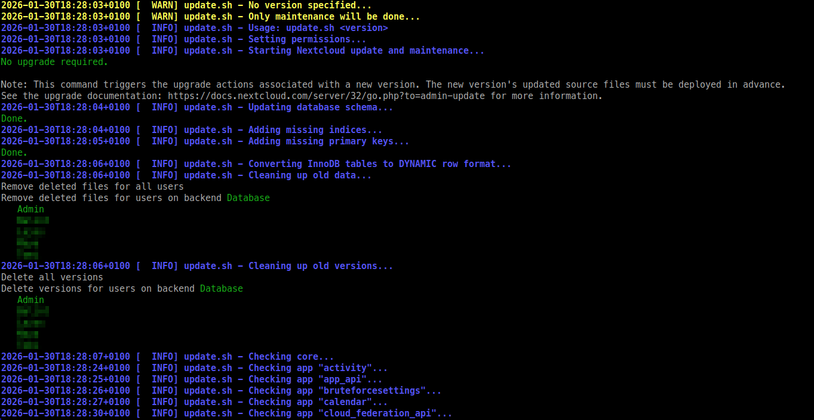

# Nextcloud Updater 🔄☁️

A simple bash script to automate Nextcloud updates and maintenance tasks.




## ⚠️ IMPORTANT – Read Before Using

This script is intended for **classic / tarball-based Nextcloud installations**
(e.g. /var/www/nextcloud).

It is **NOT suitable** for:

- Docker-based installations
- Snap packages
- Nextcloud AIO

If you are using those, follow the official update mechanism instead.

## Features

- Download and install specified Nextcloud versions
- Database maintenance (missing columns, indices, primary keys)
- InnoDB table optimization (ROW_FORMAT=DYNAMIC)
- Integrity checks for core and apps
- Automatic app updates
- Automatic cleanup of “extra files” that may remain after a Nextcloud update
- Trashbin and version cleanup

## 📦 Prerequisites

- Linux server with Nextcloud installed
- Root or sudo access
- Required packages: `wget`, `unzip`, `jq`, `mysql-client`, `php-cli`, `sudo`
- Database authentication must be configured (e.g. via ~/.my.cnf).

## 🚀 Quickstart / Installation

```bash
cd /var/www  # or wherever your nextcloud directory is located
wget https://raw.githubusercontent.com/Swiftyhu/nextcloud-updater/main/update.sh
chmod +x update.sh
```

**Important**: Place the script in the parent directory of your `nextcloud/` folder or define the `--nextcloud-dir` parameter.

Example:

```text
/var/www/
 ├─ nextcloud/
 └─ update.sh
```

## 🧰 Usage

```bash
./update.sh [version] [options]
```

| Option                | Description         | Default     |
| --------------------- | ------------------- | ----------- |
| `--web-user USER`     | Web server user     | `www-data`  |
| `--web-group GROUP`   | Web server group    | `www-data`  |
| `--db-name NAME`      | Database name       | `nextcloud` |
| `--nextcloud-dir DIR` | Nextcloud directory | `nextcloud` |
| `-h`, `--help`        | Show help           |             |

### Examples

```bash
# Maintenance only (no version update)
sudo ./update.sh

# Update to a specific version
sudo ./update.sh 31.2.0

# Custom web user and group
sudo ./update.sh 31.2.0 --web-user nginx --web-group nginx

# Custom database name
sudo ./update.sh 31.2.0 --db-name nc_prod

# Show help
sudo ./update.sh --help
```

### 🧪 Recommended upgrade workflow

- Create full backups (database + files)
- Run the script with the target version
- Verify:
  - Web UI
  - `occ status`
- Keep backups until you are confident everything works

### 🧯 Rollback / Recovery

If something goes wrong, you should restore:

- Database dump
- `config.php`
- Previous Nextcloud code directory
- Data directory (if affected)

🚨 Rollback is **your responsibility.** 🚨

## Configuration

You can configure the script in two ways:

### 1. Edit the configuration section (lines 33-38):

```bash
WEB_USER="www-data"       # Your web server user
WEB_GROUP="www-data"      # Your web server group
DB_NAME="nextcloud"       # Your database name
NEXTCLOUD_DIR="nextcloud" # Nextcloud directory name
DIR_PERMS="750"           # Directory permissions
FILE_PERMS="640"          # File permissions
```

### 2. Use command line options:

```bash
--web-user USER       # Web server user (default: www-data)
--web-group GROUP     # Web server group (default: www-data)
--db-name NAME        # Database name (default: nextcloud)
--nextcloud-dir DIR   # Nextcloud directory name (default: nextcloud)
```

**Example**: If you're using nginx with a different group and your database is named `nc_db`:

```bash
sudo ./update.sh 31.2.0 --web-user nginx --web-group www-data --db-name nc_db
```

## ✅ What it does 

1. Downloads and extracts the specified Nextcloud version (if version given)
2. Sets proper file permissions (750 for directories, 640 for files)
3. Runs `occ upgrade`
4. Database maintenance tasks - Fixes database schema issues (missing indices, columns, primary keys)
5. Trashbin and version cleanup
6. Integrity checks for core and apps (removes extra files)
7. Updates all apps
8. Runs maintenance repair and system checks

## ❌ What it DOES NOT DO

1. It does NOT create backups
2. It does NOT guarantee a successful upgrade
3. It does NOT support Docker / Snap / AIO installations
4. It does NOT magically fix broken custom apps

## ⚠️ Warning ⚠️ **ALWAYS BACKUP YOUR DATA BEFORE RUNNING THIS SCRIPT**

🚨 Backup is NOT optional. This script makes significant changes to your Nextcloud installation. Make sure you have:

- Database backup
- Files backup
- Test in staging environment first

## 🤝 Contributing

Pull requests are welcome.

Please keep changes:

- focused

- documented

- compatible with classic Nextcloud installations

## 🛑 Support policy

This script is provided **“as is”**, without any warranty.

Issues are welcome, but there is no guaranteed support.

## 📝 Output and logging

The script prints timestamped log messages to STDERR.
Long-running steps (database fixes, integrity checks) may take several minutes.

## 📜 License

GPL-3.0

## Disclaimer

Use at your own risk. This is a community tool, not an official Nextcloud product.
